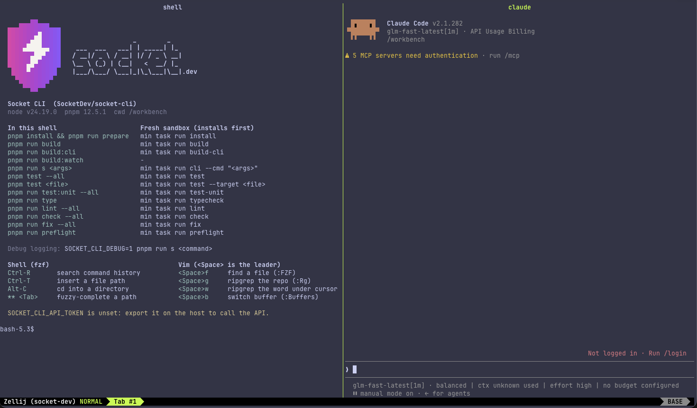

# loadout-socket-dev

A [Minimal](https://minimal.dev) loadout for working on
[SocketDev/socket-cli](https://github.com/SocketDev/socket-cli) and
[SocketDev/socket-mcp](https://github.com/SocketDev/socket-mcp). Attach to a
session and you get a zellij layout: a shell with the repo's commands on the
left, Claude Code on the right. Vim, fzf and bat come with it.



It has two parts. **The loadout** (`loadout.toml` and helpers) is yours and
works for both repos. **A `minimal.toml` per repo** (`socket-cli.minimal.toml`,
`socket-mcp.minimal.toml`) sets the toolchain, an install hook and `min task`
commands.

## Install

Needs min 0.6 or later.

```sh
# 1. The loadout. The directory name is the loadout's name.
git clone https://github.com/mitodrummer/loadout-socket-dev.git \
  ~/.config/minimal/loadouts/socket-dev

# 2. The repo config (use socket-mcp.minimal.toml for socket-mcp).
cd ~/src/socket-cli && mkdir -p .minimal
cp ~/.config/minimal/loadouts/socket-dev/socket-cli.minimal.toml .minimal/minimal.toml

# 3. Activate and attach.
min session activate --loadout socket-dev --attach
```

To run the install at activation, allow the repo's hook in
`~/.config/minimal/user_policy.toml`. Otherwise activation asks, and without
approval you run `pnpm install` yourself.

```toml
[hooks]
allow = ["/Users/you/src/socket-cli", "/Users/you/src/socket-mcp"]
```

Credentials come from your host shell, and each one is optional:
`CLAUDE_CODE_OAUTH_TOKEN` or `ANTHROPIC_API_KEY` (otherwise Claude asks you to
log in), `SOCKET_API_TOKEN` (socket-mcp's servers and e2e tests),
`SOCKET_CLI_API_TOKEN` and `SOCKET_CLI_ORG_SLUG` (socket-cli API calls), and
`GH_TOKEN`.

`--loadout` replaces your `default_loadouts`. Don't combine it with another
loadout that sets `PROMPT_COMMAND` or opens its own zellij layout. Attaching
again rejoins the layout; `zellij delete-session --force socket-dev` resets it.

## Using it

The welcome shell lists every command for the repo. Each one runs two ways:
in the shell against the session's `node_modules` (fast), or as
`min task run <name>` in a fresh sandbox that installs from the lockfile first
(CI-shaped). Run `bash ~/.local/bin/socket-welcome` to print the list again.

| | Shell (fzf) | | Vim (`<Space>` is the leader) |
| --- | --- | --- | --- |
| Ctrl-R | search history | `<Space>f` | find a file (`:FZF`) |
| Ctrl-T | insert a file path | `<Space>g` | ripgrep the repo (`:Rg`) |
| Alt-C | cd into a directory | `<Space>w` | ripgrep the word under the cursor |
| `**<Tab>` | fuzzy-complete a path | `<Space>b` | switch buffer (`:Buffers`) |

## Toolchain

- **Node:** `node-lts` (24.x). The repos pin 26.8.1, which the Minimal catalog
  doesn't carry yet; their `engines.node` is `>=24`.
- **pnpm:** the catalog's 11.21 is older than the repos accept, so
  `PNPM_CONFIG_PM_ON_FAIL=download` has pnpm fetch the newest matching release
  (12.5.1, as Socket's CI uses) from npm. Drop it once the catalog has
  pnpm 12.3.4 or later.
- **Repo tools:** `zizmor` in both repos, plus `uv` and `python` in socket-cli,
  from `.config/repo/external-tools.json`. `sfw` and `gh-aw` aren't in the
  catalog; the fleet setup downloads them itself.
- **`procps-ng`:** supplies `ps`. Socket's `memory-pressure-guard` shells out to
  it before every `build`, `check`, `cover`, `preflight`, `test` and `type`
  script, and fails closed when the process table is unreadable. Without it the
  guard blocks those commands instead of running them.

## Known issues

- **socket-cli's `pnpm run build` fails** (as of 2026-09-24) with
  `Cannot find module 'scripts/fleet/process/run-main.mts'`. `prepare`
  downloads Socket's newest "green" fleet pack, which moved that file, and
  socket-cli's scripts still import the old path. It affects every commit and
  needs a fix upstream.
- **Claude's model list comes from the repo.** Socket's fleet hooks write
  `.claude/settings.local.json` with GLM and DeepSeek entries routed through
  their `ai-balancer` proxy. Without that proxy, pick an Anthropic model with
  `/model`.
- **`prepare` edits user config** (`~/.claude/settings.json`,
  `~/.claude.json`) and warns about the missing system keyring and
  `ai-balancer` service. In a session that's the sandbox home, and the
  warnings are harmless.

## Files

| File | Purpose |
| --- | --- |
| `loadout.toml` | Packages, patches and variables for the session |
| `socket-dev-session` | Opens the zellij layout at attach |
| `layout.kdl` | The two-pane layout |
| `socket-welcome` | The welcome: logo, commands and shortcuts |
| `socket-claude-launch` | Updates Claude Code, enables the Minimal skills plugin, then starts it |
| `bashrc` | The shell pane's fzf setup |
| `vimrc`, `fzf.vim` | Vim settings and fzf's Vim plugin (MIT, junegunn/fzf v0.74.2) |
| `socket-cli.minimal.toml`, `socket-mcp.minimal.toml` | Each repo's `.minimal/minimal.toml` |
